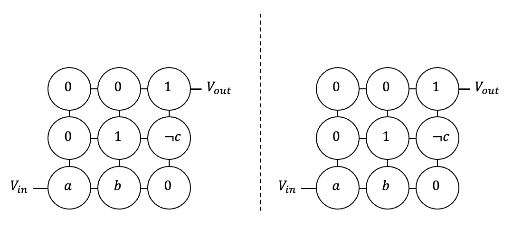

# UpTime: Towards Flow-based In-Memory Computing with High Fault-Tolerance

UpTime is  part of the [MemX](https://github.com/sventhijssen/memx) digital in-memory computing package. MemX supports both flow-based in-memory computing and path-based in-memory computing.

## Citation
When using our repository or building further upon our work, please cite our paper:

```
Thijssen, S., Rashed, M. R. H., Jha, S. K., & Ewetz, R. (2023, July). UpTime: Towards Flow-based In-Memory Computing with High Fault-Tolerance. In 2023 60th ACM/IEEE Design Automation Conference (DAC) (pp. 1-6). IEEE.
```

## Introduction
### Flow-based computing
Flow-based computing is an in-memory computing paradigm on nanoscale memristor crossbars. The memristors are assigned Boolean literals (Boolean variables and their negations), and the Boolean truth values '0' and '1'.

Definition: Given a crossbar design for a Boolean function φ, then the Boolean function φ evaluates to true if and only if there exists a path along low resistive memristors from the input nanowire (bottom most nanowire) to the output nanowire (top most nanowire) when a high input voltage is applied to the input nanowire.


<br>
Figure 1: Flow-based computing.

### Problem formulation
Stuck-at-faults prevent the reprogramming of a non-volatile resistive device, possibly resulting in incorrect function evaluations.\
These faults may be introduced in hardware during fabrication or at runtime.

### Overview of the UpTime framework
To overcome the effects of stuck-at-faults, we propose the UpTime framework. The framework has two components:
1. Error detection
2. Data layout reorganization

#### Error detection
Error detection is based on the evaluation of both the Boolean function f and its complement f'. \
By definition, both f and f' must evaluate to different truth values, which can be easily verified using XOR(f, f').
The area overhead to implement f' is small using the COMPACT synthesis framework.

#### Data layout reorganization
When an error is detected, we must reassign the design for the Boolean function to the crossbar to cover all stuck-at-faults.
We propose an ILP formulation where both rows and columns are permuted.

## Publications
- Thijssen, S., Rashed, M. R. H., Jha, S. K., & Ewetz, R. (2023, July). [UpTime: Towards Flow-based In-Memory Computing with High Fault-Tolerance](https://ieeexplore.ieee.org/document/10247692). In 2023 60th ACM/IEEE Design Automation Conference (DAC) (pp. 1-6). IEEE.

## Related work
- Thijssen, S., Rashed, M., Jha, S. K., & Ewetz, R. READ-based In-Memory Computing using Sentential Decision Diagrams. ASP-DAC 2024. (accepted)
- Thijssen, S., Rashed, M., Zheng, H., Jha, S. K., & Ewetz, R. Towards Area-Efficient Path-Based In-Memory Computing using Graph Isomorphisms. ASP-DAC 2024. (accepted)
- Thijssen, S., Rashed, M., Singireddy, S., Jha, S. K., & Ewetz, R. Verification of Flow-Based Computing Systems using Bounded Model Checking. ICCAD 2023. (accepted) 
- Thijssen, S., Jha, S. K., & Ewetz, R. (2023, January). [FLOW-3D: Flow-Based Computing on 3D Nanoscale Crossbars with Minimal Semiperimeter](https://ieeexplore.ieee.org/document/10044773). In Proceedings of the 28th Asia and South Pacific Design Automation Conference (pp. 775-780).
- Thijssen, S., Jha, S. K., & Ewetz, R. (2022, October). [Equivalence Checking for Flow-Based Computing](https://ieeexplore.ieee.org/document/9978381). In 2022 IEEE 40th International Conference on Computer Design (ICCD) (pp. 656-663). IEEE.
- Thijssen, S., Jha, S. K., & Ewetz, R. (2022, July). [Path: Evaluation of boolean logic using path-based in-memory computing](https://dl.acm.org/doi/pdf/10.1145/3489517.3530596). In Proceedings of the 59th ACM/IEEE Design Automation Conference (pp. 1129-1134). **Publicity Paper** 
- Thijssen, S., Jha, S. K., & Ewetz, R. (2021). [Compact: Flow-based computing on nanoscale crossbars with minimal semiperimeter and maximum dimension](https://ieeexplore.ieee.org/document/9662445). IEEE Transactions on Computer-Aided Design of Integrated Circuits and Systems, 41(11), 4600-4611.
- Thijssen, S., Jha, S. K., & Ewetz, R. (2021). [COMPACT: Flow-Based Computing on Nanoscale Crossbars with Minimal Semiperimeter](https://ieeexplore.ieee.org/document/9473995). In 2021 Design, Automation & Test in Europe Conference & Exhibition (DATE) (pp. 232-237). IEEE. **Nominated for Best Paper Award** 

## Requirements

### Windows
- Install and enable [Windows Subsystem for Linux](https://docs.microsoft.com/en-us/windows/wsl/install-win10#install-windows-subsystem-for-linux). 
- Python 3.10 or higher
- CPLEX 20.1.0.0

### Linux
- Python 3.10 or higher
- CPLEX 20.1.0.0

### MacOS
- Python 3.10 or higher
- CPLEX 20.1.0.0

## Installation

### Submodules
Clone this git repository and the required submodules [ABC](https://people.eecs.berkeley.edu/~alanmi/abc/). For ABC, make sure to clone the submodule from [here](https://github.com/sventhijssen/abc).
Clone the submodules using the following command:

```bash
git submodule update --init --recursive
```

#### ABC
Compile the ``ABC`` tool in the directory _abc_. 

```bash
cd abc
make
```

#### Python packages and dependencies
Use the package manager [pip](https://pip.pypa.io/en/stable/) to install the Python dependencies in ``requirements.txt``.

```bash
pip3 install -r requirements.txt
```

## Usage
For examples on how to use the UpTime framework, please refer to the [_examples_](examples) directory where the framework is explained step-by-step.

## Version
UpTime version 1.0.0

## Contact
_Sven Thijssen  
University of Central Florida  
sven.thijssen (at) ucf.edu  
https://www.sventhijssen.com/_

## Additional references
- Brayton, R., & Mishchenko, A. (2010). [ABC: An academic industrial-strength verification tool](https://link.springer.com/chapter/10.1007/978-3-642-14295-6_5). In Computer Aided Verification: 22nd International Conference, CAV 2010, Edinburgh, UK, July 15-19, 2010. Proceedings 22 (pp. 24-40). Springer Berlin Heidelberg.
- Wille, R., Große, D., Teuber, L., Dueck, G. W., & Drechsler, R. (2008, May). [RevLib: An online resource for reversible functions and reversible circuits](https://revlib.org/). In 38th International Symposium on Multiple Valued Logic (ismvl 2008) (pp. 220-225). IEEE.

## License
    Copyright 2023 Sven Thijssen

    Licensed under the Apache License, Version 2.0 (the "License");
    you may not use this file except in compliance with the License.
    You may obtain a copy of the License at

        http://www.apache.org/licenses/LICENSE-2.0

    Unless required by applicable law or agreed to in writing, software
    distributed under the License is distributed on an "AS IS" BASIS,
    WITHOUT WARRANTIES OR CONDITIONS OF ANY KIND, either express or implied.
    See the License for the specific language governing permissions and
    limitations under the License.